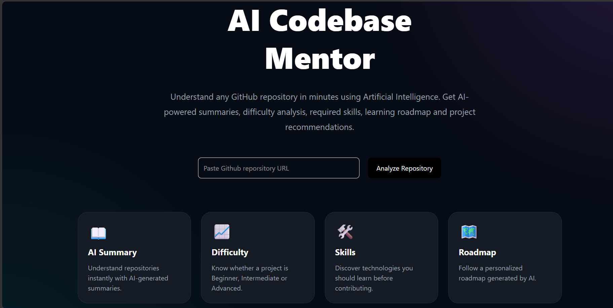
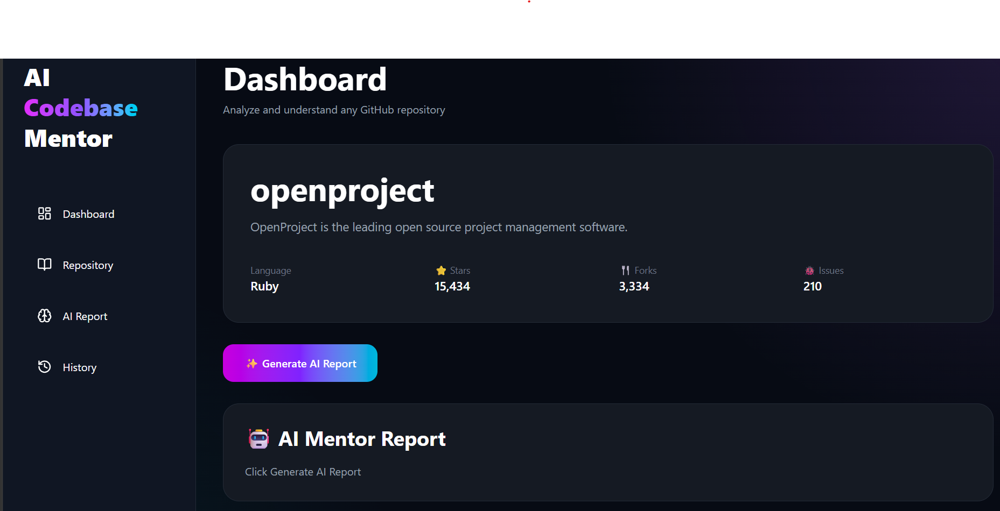
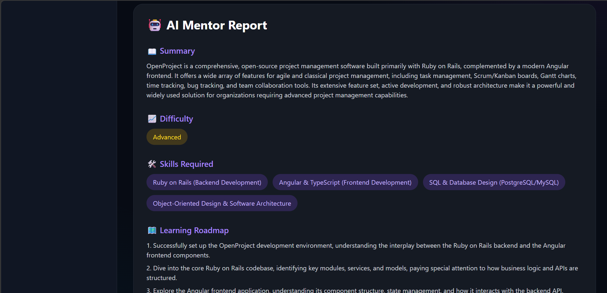

# 🤖 AI Codebase Mentor

An AI-powered GitHub Repository Analyzer that analyzes any public GitHub repository and generates an AI-powered summary, difficulty level, required skills, learning roadmap, and mini project recommendations.

## 🚀 Live Demo

https://ai-codebase-mentor.vercel.app

## ✨ Features

- Analyze any public GitHub repository
- AI-generated project summary
- Difficulty analysis
- Skills required
- Learning roadmap
- Mini project suggestions
- Recent repository history

## 🛠 Tech Stack

- React
- Vite
- JavaScript
- GitHub REST API
- Gemini AI
- Tailwind CSS
- Vercel

## 📷 Screenshots


### Home Page



### Dashboard



### AI Report



## Installation

```bash
npm install
npm run dev
```

## Author

**Bhoomikaa S**